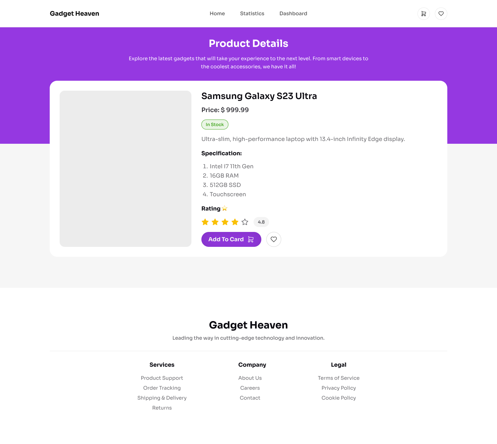

# Gadget Heaven


## Overview

Gadget Heaven is a React application. It is built using modern React and React Router practices, including functional components and dynamic routes.

## Read the docs 

Requirement Document : <a href="./public/Batch-10_Assignment-08.pdf">Read Docs</a>

## Design 




## Features

- Dynamic Web Application
- You can add product to the cart and buy it. 
- You can add product to wish list
- Chart for completed books
- Responsive design

## Tech Stack and packages

- React.js
- React Router
- Rechart
- React Toastify
- React Helmet
- Tailwind CSS
- DaisyUI

## Installation

To get started with the project, follow these steps:

```sh
# Clone the repository
git clone https://github.com/mdsaifurrahman117/Mission-Developer-Assignment-08.git

# Navigate into the project directory
cd Mission-Developer-Assignment-08

# Install dependencies
npm install

# Start the development server
npm run dev
```

## Available Scripts

In the project directory, you can run:

#### `npm run dev`

Runs the app in development mode.

#### `npm test`

Launches the test runner.

#### `npm run build`

Builds the app for production.

#### `vercel --prod`

Deploy for production.

## Project Structure

```
Mission-Developer-Assignment-08/
│── public/               # Static assets (assets, design, icons, etc.)
│   ├── assets/ 
│   │   ├── design        # Application design
│   │   │   ├── Gadget-Heaven-Cart.jpg
│   │   │   ├── Gadget-Heaven-Details.jpg
│   │   │   ├── Gadget-Heaven-Home.jpg
│   │   │   ├── Gadget-Heaven-Statistic.jpg
│   │   │   ├── Gadget-Heaven-Success.jpg
│   │   │   └── Gadget-Heaven-Wishlist.jpg
│   │   └── favicon.png   # Favicon
│   ├── Batch-10_Assignment-08.pdf
│   └── products.json     # Application data
│
│── src/                  # Main source code
│   ├── assets/           # Static assets like images, etc.
│   │   ├── banner.jpg
│   │   └── Group.jpg
│   ├── components/       # Reusable components
│   │   ├── cart/         # Cart components
│   │   │   ├── Cart_product.jsx
│   │   │   └── Cart.jsx
│   │   ├── products/     # Products components
│   │   │   ├── Product_details.jsx
│   │   │   ├── Products.jsx
│   │   │   └── Product.jsx
│   │   ├── wishlist/     # Wishlist components
│   │   │   ├── Wishlist_product.jsx
│   │   │   └── Wishlist.jsx
│   │   ├── Button.jsx
│   │   ├── Footer.jsx
│   │   ├── Header.jsx
│   │   └── Hero.jsx
│   ├── layout/           # Page layout
│   │   └── Root.jsx      # Root element
│   ├── pages/            # Page components (Error page, Dashboard, Reviews, Statistic etc.)
│   │   ├── review/       # Review components
│   │   │   ├── Review.jsx
│   │   │   └── Reviews.jsx
│   │   ├── Dashboard.jsx
│   │   ├── Error_page.jsx
│   │   └── Statistic.jsx
│   ├── utility/          # Utility functions/helpers
│   │   ├── add_to_cart.js
│   │   └── add_to_wishlist.js
│   ├── App.jsx           # Root component
│   ├── index.css         # Style element (Tailwind CSS, CSS, Fonts, etc)
│   └── main.jsx          # Main entry point
│
│── .gitignore            # Git ignore file
│── eslint.config.js      # ESLint config file
│── index.html            # Index html file
│── package-lock.json     # Node package manager
│── package.json          # Dependencies and scripts
│── README.md             # Documentation
│── vercel.json           # Vercel configuration
└── vite.config.js        # Vite configuration (if using Vite)
```

## Deployment

This project is deployed on vercel.

- Live site : https://mission-developer-assignment-08.vercel.app

This project can be deployed using:

To deploy with Vercel:

```sh
npm install -g vercel
npm run build
vercel --prod
```

## Contact

For questions or issues, please reach out to [[saifurrahmansaif954@gmail.com](mailto\:saifurrahmansaif954@gmail.com)] or open an issue in the repository.


